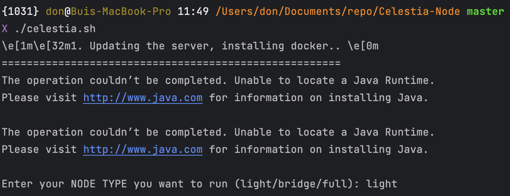
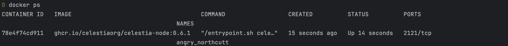

<h1 align="center"> Celestia Node BXDOAN

## If you don't want to having problems with claim for a possible Celestia airdrop, this guide is for you. Do not forget to star and fork from the top right. If you have questions: [Chat](https://t.me/bxdoan)


## System Requirements:
NODE TYPE | CPU | RAM | SSD     | Bandwidth
| ------------- |-----|-----| -------- | -------- |
| Mainnet | 4   | 8   | 400-500  | 1 Gbps for Download/100 Mbps for Upload


[here](https://docs.celestia.org/developers/node-tutorial) for more information

## Install the Celestia node.

### Open a screen.
Install screen if you don't have it.

Linux:
```sh
sudo apt install screen -y
```

macOS
```sh
brew install screen -y
```

open a screen
```sh
screen -S celestia
```

### Scripted installation.


```
wget -O celestia.sh https://raw.githubusercontent.com/bxdoan/Celestia-Node/main/celestia.sh && chmod +x celestia.sh && ./celestia.sh
```

you will see something like this and type your node type you want to run (full, bridge or light):


The result will be like this:


Run `docker ps` to show docker container name:


## Setup inside docker container.
copy bash script into docker container
```shell
#docker cp "$HOME/$repo_name/setup_inside.sh" "$CONTAINER_NAME":/root/setup_inside.sh

docker_image=$(docker ps | grep ghcr.io/celestiaorg | awk '{print $NF}')
docker cp $HOME/Celestia-Node/setup_inside.sh "$docker_image":/root/setup_inside.sh
```
and execute it
```shell
#docker exec -it "$CONTAINER_NAME" bash /root/setup_inside.sh

docker_image=$(docker ps | grep ghcr.io/celestiaorg | awk '{print $NF}')
docker exec -it $docker_image bash /root/setup_inside.sh
```
## Backup your wallet and keys.

Go to inside docker container by using command:
```sh
docker_image=$(docker ps | grep ghcr.io/celestiaorg | awk '{print $NF}')
docker exec -it $docker_image bash
```

Run this command to show your wallet and keys, then backup it:
```sh
~/celestia-node/cel-key list --node.type light --keyring-backend test
```

## Contact
[Telegram](https://t.me/bxdoan)

[Email](mailto:hi@bxdoan.com)

## Thanks for use
Buy me a coffee

[](https://paypal.me/bxdoan)
